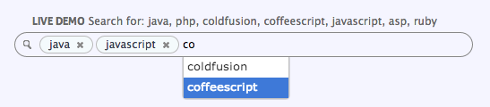

WALL.JS
=========

A tutorial on how to make a multi-token search with Backbone and jQuery UI autocomplete.

Check `test/index.html` for a simple example, or [http://rtsinani.github.com/wall/](http://rtsinani.github.com/wall/) for the demo and annotated source.

Licence: Free

